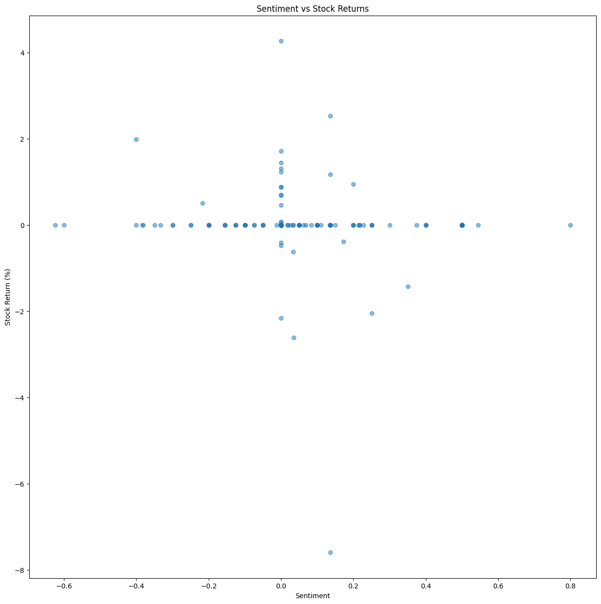

Analysis Jupyter Notebook
Overview
This Jupyter Notebook is an integral part of the Stock Market Analyzer project. It provides a step-by-step workflow for importing data, analyzing relationships between stock trends and news sentiment, and visualizing the results. The notebook incorporates modular functions from custom Python scripts for efficient and reusable analysis.

Requirements
To run this notebook, ensure the following dependencies are installed in your Python environment:
•	Python 3.x
•	Libraries: 
o	pandas
o	numpy
o	matplotlib
o	seaborn
o	nltk
o	vaderSentiment
o	TA-Lib
o	os
o	sys
Additionally, custom scripts from the ../scripts directory are utilized. Ensure this directory is accessible and contains the necessary files (data_loader.py, data_analysis.py, etc.).

File Structure
•	Notebook: analysis.ipynb
•	Data Folder: 
o	News Data: ../Data/raw_analyst_ratings.csv
o	Stock Data: ../Data/yfinance_data/
•	Scripts Folder: ../scripts/ 
o	Includes custom Python scripts: 
	data_loader.py
	data_analysis.py
	market_analysis.py
	data_visualization.py

Usage
1. Setup the Environment:
•	Add the ../scripts folder to your Python path for importing functions: 
•	import os
•	import sys
•	sys.path.append(os.path.abspath("../scripts"))
2. Load Dataset:
•	Define the file paths for your datasets: 
•	news_data_path = "../Data/raw_analyst_ratings.csv"
•	stock_data_dir = "../Data/yfinance_data/"
•	Load the datasets using the load_dataset and load_all_data functions: 
•	from data_loader import load_dataset, load_all_data
•	
•	news_data = load_dataset(news_data_path)
•	stock_data = load_all_data(stock_data_dir)
3. Perform Data Analysis:
•	Use the functions provided in data_analysis.py to explore and analyze datasets: 
•	from data_analysis import summarize_data
•	summarize_data(stock_data)
4. Conduct Sentiment Analysis:
•	Analyze sentiment in the news data: 
•	from market_analysis import sentiment_analysis
•	news_sentiment = sentiment_analysis(news_data)
5. Merge and Align Data:
•	Combine stock and news data for correlation analysis: 
•	from market_analysis import prepare_data
•	merged_data = prepare_data(news_sentiment, stock_data)
6. Visualize Results:
•	Use data_visualization.py functions to create graphs and insights: 
•	from data_visualization import plot_sentiment_vs_stock
•	plot_sentiment_vs_stock(merged_data)
7. Save Outputs:
•	Save processed datasets or visualizations as needed: 
•	merged_data.to_csv("../Data/processed_data.csv", index=False)

Results
•	Key Outputs:
o	Summary statistics for stock and news data.
o	Sentiment scores for news headlines.
o	Merged dataset aligning stock prices with news sentiment.
o	Visualizations of sentiment trends, stock price indicators, and their correlations.
•	Generated Plots:
o	Sentiment distribution in news headlines.
o	Stock price trends with technical indicators (RSI, MACD).
o	Sentiment vs. stock returns over time.

Notes
•	Verify that the relative paths for data and scripts are accurate before running the notebook.
•	If any compatibility issues arise with libraries like TA-Lib, refer to the installation steps in the project documentation.
•	Customize parameters (e.g., date ranges, analysis metrics) within the notebook as needed.
•Select a company from the following list:
• To run the notebook, please first select the notebook. Once selected, the output will display a list of companies.
 Select a company from the following list:
APPLE
AMAZON
GOOGLE
META
MICROSOFT
NVIDIA
TESLA
To choose a company, simply select the corresponding number.

Future Enhancements
•	Integrate more advanced machine learning models for predictive analysis.
•	Expand markdown documentation to include detailed explanations of all analysis steps.
•	Add interactive visualizations using libraries like Plotly.

example for amazom it looks like pleas press ctrl and click
